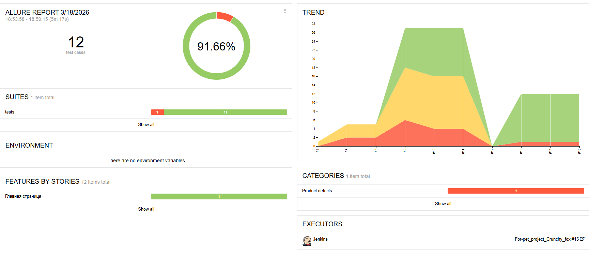
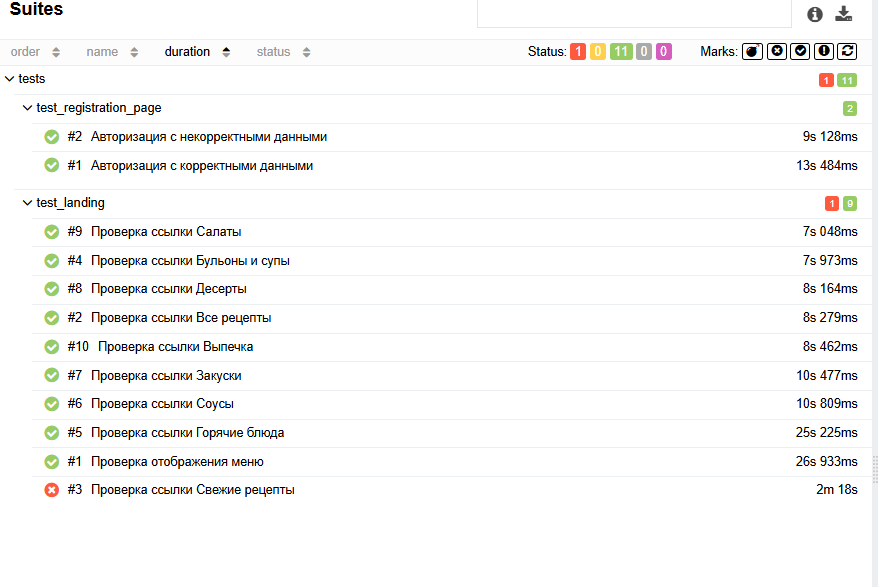

    
  

# UI Tests for Povarenok.ru

Автоматизированные UI-тесты для сайта **https://www.povarenok.ru**  
Проект реализован с использованием **Pytest, Selenium, Selene и Allure**.

Цель проекта — разработка автоматизированных UI-тестов и демонстрация навыков работы с Page Object Pattern и современным стеком тестирования Python.

---

## 📌 Стек технологий

- Python 3.x
- Pytest
- Selenium WebDriver
- Selene
- Allure Report

---
---

## 🧪 Реализованные тесты

### 1. Проверка формы регистрации

Проверяется:

- Ввод валидного логина
- Ввод невалидного логина
- Ввод валидного пароля
- Ввод невалидного пароля
- Переход на страницу регистрации

Примеры проверок:

- минимальная длина логина
- допустимые символы
- корректность пароля

---

### 2. Проверка ссылок сайта

Проверяется наличие и корректность ссылок меню:

- Все рецепты
- Свежие рецепты
- Бульоны и супы
- Горячие блюда
- Салаты
- Закуски
- Выпечка
- Десерты
- Соусы

Проверяется:

- наличие элементов
- корректные URL ссылок

---

### 3. Проверка названия сайта

Проверяется:

- корректное отображение названия сайта
- наличие названия на странице

---

## 🧱 Архитектура

Проект реализован с использованием:

- Page Object Pattern
- Pytest Fixtures
- Selenoid cross browser

Ссылка на Allure джобу - https://jenkins.autotests.cloud/job/For-pet_project_Crunchy_fox/15/
 
 